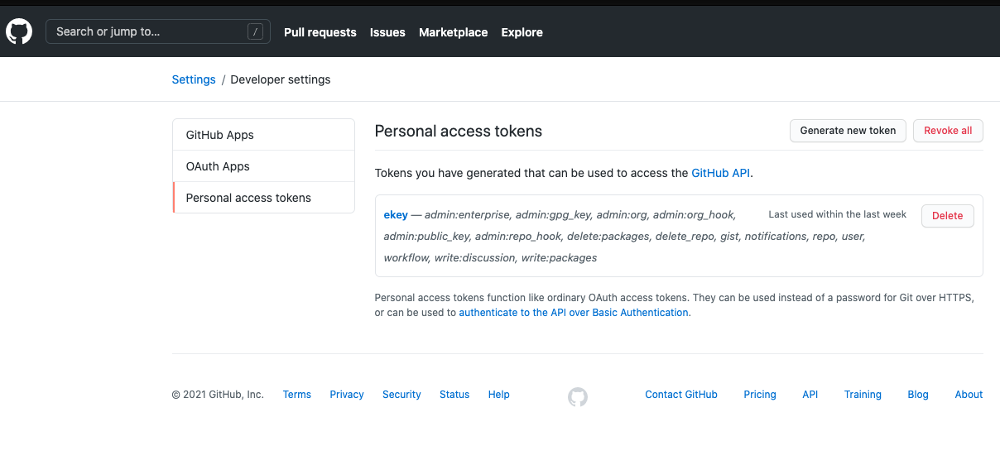
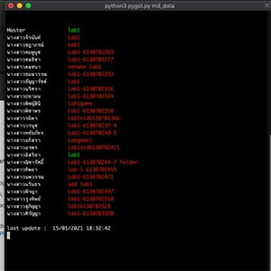
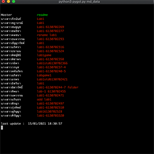

Python Github for Learn 

1 ติดตั้ง python modules 
python3 -m pip install pygithub 
python3 -m pip install  blessings  

2 สร้างไฟล์ github token key ชื่อ key.key 
เข้าไปที่เมนู https://github.com/settings/profile -> Develper Settings 
เลือก Personal access tokens จะมีปุ่ม Generate new token เอารหัส token ที่ได้ไปวางไว้ในไฟล์ชื่อ key.key

3 สร้างไฟล์ data.txt 

รหัสนักศึกษา ชื่อ นามสกุล username/gitrepo โดยที่คนแรกเป็นชื่ออาจารย์เพื่อใช้เปรียบเทียบ git commit message
 
ตัวอย่าง

Techer Master Aj 24engiball/pygol 
493040269-7 Thee Ball studentUsername/studentGitRepoName 

 

python3 pygol.py [ชื่อไฟล์].txt 

เช่น 

python3 pygol.py data.txt

เมื่อมีเด็กส่งงาน commit ตาม task ที่กำหนด ก็จะเปลี่ยนข้อความ commit เป็นสีเขียว

 

